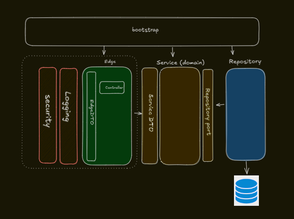

# Reservation Service

This project is part of the **Azki Insurance** system, responsible for handling reservation-related operations.

## Tech Stack
- **Java 21**: Core programming language.
- **Spring Boot 3.4.2**: Framework for building the application, including:
    - **Spring Web**: RESTful API development.
    - **Spring Security**: Authentication and authorization.
    - **Spring Data JPA**: ORM for database interactions.
    - **Spring Cache**: Caching support.
    - **Spring Session**: Session management with Redis.
- **Oracle DB**: Primary database for persistence.
- **Redis**: Used for caching and session management.
- **QueryDSL & Blaze Persistence**: Advanced query handling and optimization for JPA.
- **MapStruct**: Automatic mapping between entities and DTOs.
- **Lombok**: Reduces boilerplate code (e.g., getters, setters).
- **Apache Commons**: Utility libraries:
    - **commons-lang3**: String and object utilities.
    - **commons-io**: File and stream handling.
    - **commons-beanutils**: Bean manipulation.
- **Docker & Docker Compose**: Containerization and orchestration.
- **Jasypt**: Encryption for sensitive configuration properties.
- **Springdoc OpenAPI**: API documentation via Swagger UI.

## System Requirements
- **Java 21**: Ensure JDK is installed.
- **Maven 3.8+**: For building the project.
- **Docker & Docker Compose**: For containerized deployment.
- **Oracle DB**: Version 21.3+ recommended; requires a running instance.
- **Redis**: Version 7+ recommended; needed for caching and sessions.

## Architecture Overview
Below is a high-level diagram of the Reservation Service architecture:



- **Bootstrap**: Initializes the application and orchestrates components.
- **Security**: Handles authentication and authorization.
- **Logging**: Manages application logs.
- **Edges (Controller)**: Exposes RESTful API endpoints.
- **Service (Domain)**: Contains business logic.
- **Repository**: Manages data persistence with Oracle DB.
- **Database**: Stores reservation data.

## Project Structure

`azki-insurance` is a multi-module Maven project with a parent `pom.xml` at the root, organizing the codebase into shared and service-specific modules. Below is the structure:

- **`common`**: Shared modules used across the project.

- **`reservation-service`**: Modules for the reservation service:
    - `reservation-application`: RESTful API endpoints.
    - **`reservation-bootstrap`**: Entry point and initialization logic.
    - **`reservation-data-access`**: Database interactions and repositories.
    - **`reservation-domain`**: Service-specific domain models.

- **`docker-compose`**: Houses Docker Compose configurations to manage multi-container services, including `reservation-service`.
### API Documentation
http://localhost:8381/swagger-ui/index.html

## Future Improvements
- **Second-Level Caching**: Integrate Hibernate’s second-level cache with Redis to improve performance.
- **IAM Separation**: Isolate identity and access management for the reservation module.
- **Comprehensive Testing**: Expand unit and integration tests for full coverage.
- **Flyway**: Implement database migrations for version control.
- **DevOps Tooling**: Develop a utility for managing encrypted passwords with Jasypt.
- **Protobuf for Redis**: Use Protocol Buffers for efficient serialization in Redis.
- **(RBAC) Authorization**: Implementing a mechanism for role based authorization

## How to Build & Run

### Prerequisites
- Oracle DB: Set up a database instance and note the connection details (host, port, SID, credentials).
- Redis: Install and run Redis locally(recommended) or via Docker (`docker run -d -p 6379:6379 redis`).

### Build the Application
- Before running the application please consider the '[reservation-service.yml](docker-compose/reservation-service/reservation-service.yml)' file for environment configuration
```sh

mvn clean package

Building Docker Image:
cd ./docker-compose/
docker build -t com.azki.insurance/reservation.service:0.0.1-SNAPSHOT .

Running with Docker Compose (current directory is docker-compose):
cd ./reservation-service/
docker-compose -f common.yml -f reservation-service.yml up -d

Stopping the Application (current directory is reservation-service):
docker-compose -f common.yml -f reservation-service.yml down
